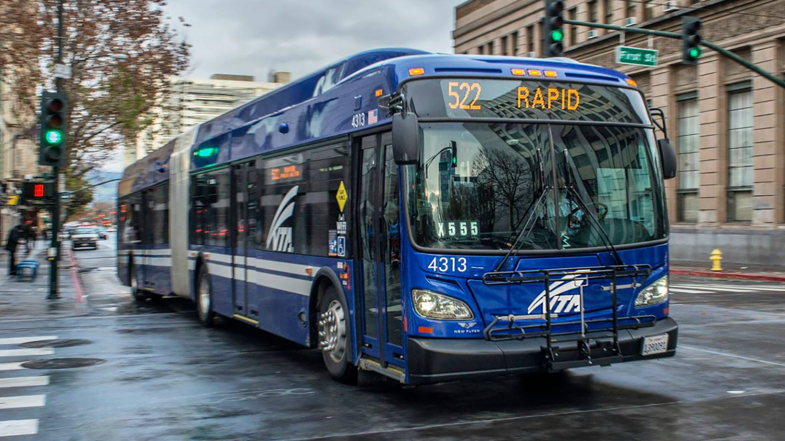

# VTA ChatBot 
> Rule based chat bot to assist VTA commuters



## Conversational UI

Conversation I(bus schedule):
* User: Talk to VTA ChatBot
* Bot: What bus or light rail schedule you'd like to know about?
* User: Dash bus from diridon
* Bot: Next 2 departures will occur at 2:40 PM and 2:50 PM

Conversation II(light rail schedule:
* User: Talk to VTA ChatBot
* Bot: What bus or light rail schedule you'd like to know about?
* User: Light rail from fruitdale station
* Bot: What direction are you going?
* User: Winchester
* Bot: Next 2 departures will occur at 2:40 PM and 2:50 PM

## Supported VTA Routes

* Dash 201
* Light Rail 902 Mtn View <-> Winchester

To be added:
* Santa Teresa light rail

### Directory 

    .
    ├── app.py                  # Contains logic, rules and CL UI
    ├── assistant.py            # Flask server for Google Assistant
    ├── data.py                 # Contains data for NLP
    ├── schedule.py             # Contains schedule for buses and light rail
    ├── state.py                # Helper class to maintain the state of the app
    ├── requirements.txt        # List of modules for Google App Engine
    ├── actions.json            # Google Actions file
    └── pics                    # Pictures
    
## Usage

Google Assistant:

Search G Assistant's app for 'VTA ChatBot'

To run chat bot with Command Line UI:
```sh
python app.py
```
To run assistant locally on 8080 port:
```sh
python assistant.py
```
 
## Meta

Please feel free to reach out:)

Danil Kolesnikov – danil.kolesnikov@sjsu.edu

Distributed under the MIT license.
